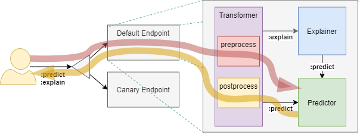

## [KFServing이란](https://www.kubeflow.org/docs/components/serving/kfserving/)

- Kubernetes [Custom Resource Definition(CRD)](https://kubernetes.io/docs/concepts/extend-kubernetes/api-extension/custom-resources/) 으로 제공되는 ML Serving 아키텍처
- Serverless로 동작 (내부적으로 Knative 사용)

 

## 1. InferenceService

 

- KFServing의 배포/서비스 단위 (CRD)
- api는 [Tensorflow V1 HTTP API](https://www.tensorflow.org/tfx/serving/api_rest#predict_api)를 따름 ([Out-of-the-box](https://m.blog.naver.com/yangseungjae/220708695668)의 경우)
- Ensembling, A/B testing, Multi-Arm-Bandits 등은 InferenceService를 조합하여 구현해야함 (단일 InferenceService로는 불가능)
  - Seldon Core와 비교됨 (참고2)

## 2. InferenceService 구성요소

### 2.1 Predictor

- 필수
- REST API path의 postfix가 `:predict`
- trained model의 serving을 수행
  - storage에 저장된 trained model을 load하여 서비스
    - 지원하는 storage provider
      - Google Cloud Storage `gs://`
      - S3 Compatible Object Storage `s3://`
      - Azure Blob Storage `https://`
      - Local filesystem `file://`
      - Persistent Volume Claim (PVC) `pvc://`
  - trained model은 프로비저닝되어 제공되는 이미지(framework)에 따름
    - 제공되는 이미지 프로비저닝 - [kfserving/docs/apis/v1beta1 at kubeflow/kfserving (github.com)](https://github.com/kubeflow/kfserving/tree/master/docs/apis/v1beta1#predictorspec)
      - tensorflow
      - tensorrt
      - xgboost
      - sklearn
      - onnx
      - pytorch

### 2.2 Transformer

- 필수아님
- prediction 또는 explanation의 실행 전/후에 수행될 로직을 탑재 (preprocess/postprocess) → 전처리 / 후처리 용도
- Interceptioon Filter로서 동작
   

### 2.3 Explainer

- 필수아님
- REST API path의 postfix가 `:explain`
- 제공되는 이미지 프로비저닝
  - [Seldon Alibi](https://github.com/SeldonIO/alibi)

## 3. InferenceService 배포

- 방법1: kubectl
  
  ```bash
  kubectl apply -f xxxxx.yaml 
  ```

- 방법2: Kubeflow Pipelines ([Sample](https://github.com/kubeflow/kfserving/blob/master/docs/samples/pipelines/sample-tf-pipeline.py))

- 방법3: [KFServing Python SDK](https://github.com/kubeflow/kfserving/blob/master/python/kfserving) ([Sample](https://github.com/kubeflow/kfserving/blob/master/docs/samples/client/kfserving_sdk_v1beta1_sample.ipynb))

## 4. InferenceService 구성요소 유형

- 역할에 따른 구분
  - Predictor
  - Transformer
  - Explainer
- 이미지 프로비저닝 여부에 따른 구분
  - [Out-of-the-box](https://m.blog.naver.com/yangseungjae/220708695668) ← 프로비저닝된 이미지 사용
  - Custom

### 4.1 [Out-of-the-box Predictor](https://github.com/kubeflow/kfserving/tree/master/docs/samples#deploy-inferenceservice-with-predictor)

- 프로비저닝 이미지를 사용
  - 프로비저닝할 프레임워크(예: tensorflow, pytorch) 명시 필요 (이미지에 대한 기술 X) 
- 모델이 저장된 위치 필요 (storageUri)

#### 4.1.1 [tensorflow](https://github.com/kubeflow/kfserving/tree/master/docs/samples/v1beta1/tensorflow) 예제

##### 4.1.1.1 manifests: [tensorflow.yaml](https://github.com/kubeflow/kfserving/blob/master/docs/samples/v1beta1/tensorflow/simple.yaml)

```yaml
apiVersion: "serving.kubeflow.org/v1beta1"
kind: "InferenceService"
metadata:
  name: "flowers-sample"
spec:
  default:
    predictor:
      tensorflow:
        storageUri: "gs://kfserving-samples/models/tensorflow/flowers"
```

#### 4.1.2 [pytorch](https://github.com/kubeflow/kfserving/tree/master/docs/samples/v1beta1/torchserve) 예제

##### 4.1.2.1 manifests: [pytorch.yaml](https://github.com/kubeflow/kfserving/blob/master/docs/samples/v1alpha2/pytorch/pytorch.yaml)

```yaml
apiVersion: "serving.kubeflow.org/v1alpha2"
kind: "InferenceService"
metadata:
  name: "pytorch-cifar10"
spec:
  default:
    predictor:
      pytorch:
        storageUri: "gs://kfserving-samples/models/pytorch/cifar10/"
        modelClassName: "Net"
```

### 4.2 [Custom Predictor](https://github.com/kubeflow/kfserving/tree/master/docs/samples/custom)

- 프로비저닝 이미지를 사용하지 않고 Custom 이미지를 사용

#### 4.2.1 [Flask Hello World](https://github.com/kubeflow/kfserving/tree/master/docs/samples/custom/hello-world) 예제

##### 4.2.1.1 manifests: [custom.yaml](https://github.com/kubeflow/kfserving/blob/master/docs/samples/custom/hello-world/custom.yaml)

```yaml
apiVersion: serving.kubeflow.org/v1alpha2
kind: InferenceService
metadata:
  labels:
    controller-tools.k8s.io: "1.0"
  name: custom-sample
spec:
  default:
    predictor:
      custom:
        container:
          image: sds.redii.net/sample/custom-sample
          env:
            - name: GREETING_TARGET
              value: "Python KFServing Sample"
```

##### 4.2.1.2 [Dockerfile](https://github.com/kubeflow/kfserving/blob/master/docs/samples/custom/hello-world/Dockerfile)

```dockerfile
# ... 선략 ...
COPY app.py requirements.txt ./
# ... 생략 ...
CMD exec gunicorn --bind :$PORT --workers 1 --threads 8 app:app
```

##### 4.2.1.3 application: [app.py](https://github.com/kubeflow/kfserving/blob/master/docs/samples/custom/hello-world/app.py)

```python
import os
from flask import Flask

app = Flask(__name__)

@app.route('/v1/models/custom-sample:predict')
def hello_world():
    greeting_target = os.environ.get('GREETING_TARGET', 'World')
    return 'Hello {}!\n'.format(greeting_target)

if __name__ == "__main__":
    app.run(debug=True, host='0.0.0.0', port=int(os.environ.get('PORT', 8080)))
```

#### 4.2.2 [kfserving-custom-model](https://github.com/kubeflow/kfserving/tree/master/docs/samples/custom/kfserving-custom-model) 예제

##### 4.2.2.1 manifests: [custom.yaml](https://github.com/kubeflow/kfserving/blob/master/docs/samples/custom/kfserving-custom-model/custom.yaml)

```yaml
apiVersion: serving.kubeflow.org/v1alpha2
kind: InferenceService
metadata:
  labels:
    controller-tools.k8s.io: "1.0"
  name: kfserving-custom-model
spec:
  default:
    predictor:
      custom:
        container:
          image: {username}/kfserving-custom-model
```

##### 4.2.2.2 [Dockerfile](https://github.com/kubeflow/kfserving/blob/master/docs/samples/custom/kfserving-custom-model/model-server/Dockerfile)

```dockerfile
# ... 선략 ...
COPY model.py  imagenet_classes.txt ./

CMD ["python", "model.py"]
```

##### 4.2.2.3 application: [model.py](https://github.com/kubeflow/kfserving/blob/master/docs/samples/custom/kfserving-custom-model/model-server/model.py)

- kfserving.KFModel을 상속받고 load()와 predict()를 구현함
- load()를 미리 호출하여 model을 restore한 후, 서버를 start()

```python
import kfserving
from typing import List, Dict

class KFServingSampleModel(kfserving.KFModel):
    def __init__(self, name: str):
        super().__init__(name)
        self.name = name
        self.ready = False

    def load(self):
        # model load 코드 생략
        self.model = model
        self.ready = True

    def predict(self, request: Dict) -> Dict:
        inputs = request["instances"]
        # predict 코드 생략
        return {"predictions": results}

if __name__ == "__main__":
    model = KFServingSampleModel("kfserving-custom-model")
    model.load()
    kfserving.KFServer(workers=1).start([model])
```

### 4.3 [Transformer](https://github.com/kubeflow/kfserving/tree/master/docs/samples/transformer/image_transformer)

#### 4.3.1 [Image Transformer with PyTorch Predictor](https://github.com/kubeflow/kfserving/blob/master/docs/samples/transformer/image_transformer) 예제

##### 4.3.1.1 manifests: [image_transformer.yaml](https://github.com/kubeflow/kfserving/blob/master/docs/samples/transformer/image_transformer/image_transformer.yaml)

```yaml
apiVersion: serving.kubeflow.org/v1alpha2
kind: InferenceService
metadata:
  name: transformer-cifar10
spec:
  default:
    transformer:
      custom:
        container:
          image: gcr.io/kubeflow-ci/kfserving/image-transformer:latest
          name: user-container  
    predictor:
      pytorch:
        modelClassName: Net
        storageUri: gs://kfserving-samples/models/pytorch/cifar10
```

##### 4.3.1.2 [Dockerfile](https://github.com/kubeflow/kfserving/blob/master/docs/samples/transformer/image_transformer/transformer.Dockerfile)

```dockerfile
# ... 선략 ...
ENTRYPOINT ["python", "-m", "image_transformer"]
```

##### 4.3.1.3 application: [image_transformer.py](https://github.com/kubeflow/kfserving/blob/master/docs/samples/transformer/image_transformer/image_transformer/image_transformer.py)

- kfserving.KFModel을 상속받고 preprocess()와 postprocess()를 구현함

```python
def image_transform(instance):
    ...생략...
    return res.tolist()

class ImageTransformer(kfserving.KFModel):
    def __init__(self, name: str, predictor_host: str):
        super().__init__(name)
        self.predictor_host = predictor_host

    def preprocess(self, inputs: Dict) -> Dict:
        return {'instances': [image_transform(instance) for instance in inputs['instances']]}

    def postprocess(self, inputs: List) -> List:
        return inputs

if __name__ == "__main__":
    transformer = ImageTransformer(args.model_name, predictor_host=args.predictor_host)
    kfserver = kfserving.KFServer()
    kfserver.start(models=[transformer])      
```

## 5.  [KFServing Python SDK](https://github.com/kubeflow/kfserving/blob/master/python/kfserving)

### 5.1 Model / Server

- "4.2 [Custom Predictor](https://github.com/kubeflow/kfserving/tree/master/docs/samples/custom) / 4.2.2 [kfserving-custom-model](https://github.com/kubeflow/kfserving/tree/master/docs/samples/custom/kfserving-custom-model) 예제" 및 "4.3 [Transformer](https://github.com/kubeflow/kfserving/tree/master/docs/samples/transformer/image_transformer)" 참조

### 5.2 Client

- "3. InferenceService 배포 / 방법3: KFServing Python SDK ([Sample](https://github.com/kubeflow/kfserving/blob/master/docs/samples/client/kfserving_sdk_v1beta1_sample.ipynb))" 참조

## 참고1: [TensorFlow Model을 Save하는 방법](https://www.tensorflow.org/tutorials/keras/save_and_load?hl=ko)

### 체크포인트

- training 중간과 training 마지막에 체크포인트(checkpoint)를 저장 
  - 다시 training 하지 않고 모델을 재사용하거나 
  - training  과정이 중지된 경우 이어서 training을 진행 가능
- `.ckpt` 파일
  - 모델의 가중치를 포함하는 하나 이상의 샤드(shard)
  - 가중치가 어느 샤드에 저장되어 있는지를 나타내는 인덱스 파일
  - 모델 전체를 저장하지 않음 → 모델 구조는 저장하지 않음

### HDF5 ([Hierarchical Data Format](https://en.wikipedia.org/wiki/Hierarchical_Data_Format#HDF5))

- 모델 전체를 저장
- `.h5` 또는 `.hdf5` 파일
  - 가중치 값
  - 모델 설정(구조)
  - 옵티마이저 설정

### TensorFlow SavedModel

- language-neutral format to save machine-learned models → Tensorflow Serving 등에서 사용
- 모델 전체를 저장
- Ref: [https://github.com/tensorflow/tensorflow/tree/master/tensorflow/python/saved_model#tensorflow-savedmodel](https://github.com/tensorflow/tensorflow/tree/master/tensorflow/python/saved_model#tensorflow-savedmodel)
- 저장 예제 코드

```python
export_dir = ...
...
builder = tf.saved_model.builder.SavedModelBuilder(export_dir)
with tf.Session(graph=tf.Graph()) as sess:
  ...
  builder.add_meta_graph_and_variables(sess,
                                       [tf.saved_model.tag_constants.TRAINING],
                                       signature_def_map=foo_signatures,
                                       assets_collection=foo_assets)
...
with tf.Session(graph=tf.Graph()) as sess:
  ...
  builder.add_meta_graph(["bar-tag", "baz-tag"])
...
builder.save()
```

- [SignatureDef](https://github.com/tensorflow/serving/blob/master/tensorflow_serving/g3doc/signature_defs.md)로 다음 항목을 정의
  - method_name
  - inputs: 입력 tensor의 이름, dtype, shape을 정의
  - outpus: 출력  tensor의 이름, dtype, shape을 정의
- 다음과 같은 구조로 모델이 저장됨

```
assets/
assets.extra/
variables/
    variables.data-?????-of-?????
    variables.index
saved_model.pb
```

## 참고2: [Seldon Core](https://docs.seldon.io/projects/seldon-core/en/stable/) Inference Graph(Pipeline)

 

- [https://docs.seldon.io/projects/seldon-core/en/stable/graph/inference-graph.html](https://docs.seldon.io/projects/seldon-core/en/stable/graph/inference-graph.html)
- [https://www.slideshare.net/seldon_io/seldon-deploying-models-at-scale](https://www.slideshare.net/seldon_io/seldon-deploying-models-at-scale) (p28)
