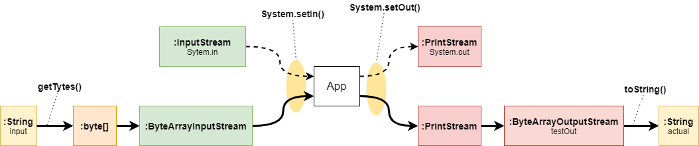

```java
public class MyTest {
  ByteArrayOutputStream testOut = new ByteArrayOutputStream();

  @Before
  public void setUpOutput() {
    System.setOut(new PrintStream(testOut));
  }

  @Test
  public void test1() throws IOException {
    String input = "6 5\r\n" + "1\r\n" + "1 2\r\n" + "1 4\r\n" + "2 3\r\n" + "4 5\r\n" + "4 6";
    String expected = "1 4 6 5 2 3 \r\n" + "6 5 4 3 2 1";

    System.setIn(new ByteArrayInputStream(input.getBytes()));
    Solution.main(null);
    String actual = testOut.toString().trim();
    assertEquals(expected, actual);
  }

  @Test
  public void test2() throws IOException {
    String input = "5 7\r\n" + "1\r\n" + "1 4\r\n" + "4 1\r\n" + "1 3\r\n" + "4 3\r\n" + "3 5\r\n" + "4 5\r\n" + "4 2";
    String expected = "1 4 5 3 2 \r\n" + "5 3 2 4 1";

    System.setIn(new ByteArrayInputStream(input.getBytes()));
    Solution.main(null);
    String actual = testOut.toString().trim();
    assertEquals(expected, actual);
  }
}
```

참고링크: https://www.baeldung.com/java-testing-system-out-println